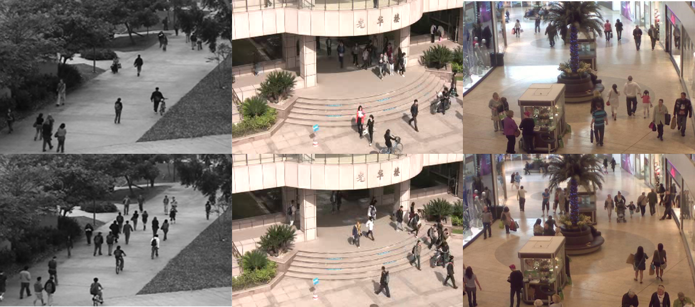

# Submodular_Crowd
Crowd counting by regression with submodular and semi-supervised learning.

We propose a submodular method to select the most informative frames from image sequences of crowds.
Specifically, the method selects the most representative images to guarantee the information coverage,
by maximizing the similarities between the group of selected images and the image sequence.
In addition, these frames are chosen to avoid redundancies and preserve diversity.
Finally, our semi-supervised method incorporates graph Laplacian regularization and spatiotemporal constraints.
Extensive experiments on three benchmark datasets demonstrate that our proposed approach achieves higher accuracy
compared with the state-of-the-art regression methods, and competitive performance with deep convolutional models,
especially when the number of labeled data is exceptionally small.

## About this project
This Project is finised during my M.S. procedure, advised by Prof. Zhang.
The paper has been accepted by IEEE Transactions on Intelligent Transportation Systems, 2018.

## About the code
The code is very verbose and mussy, like this terrible readme file. It haven't been updated for a long time, and,
emmm........ no comments in any snippet.
I'am toooooo lazy to refine the old code.....
